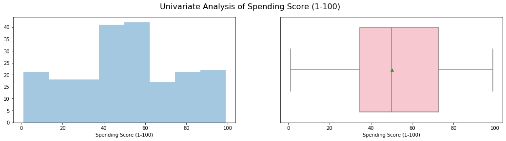
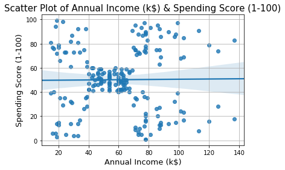
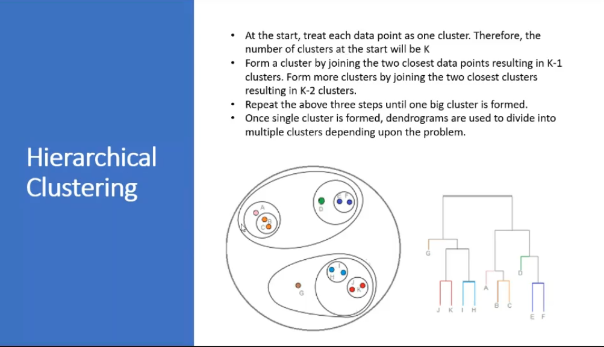
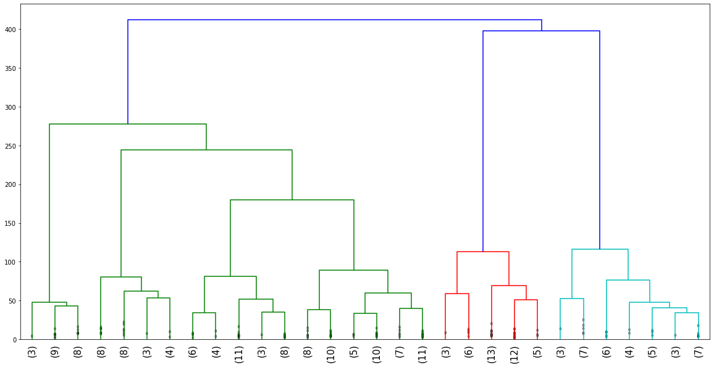
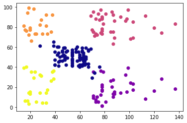
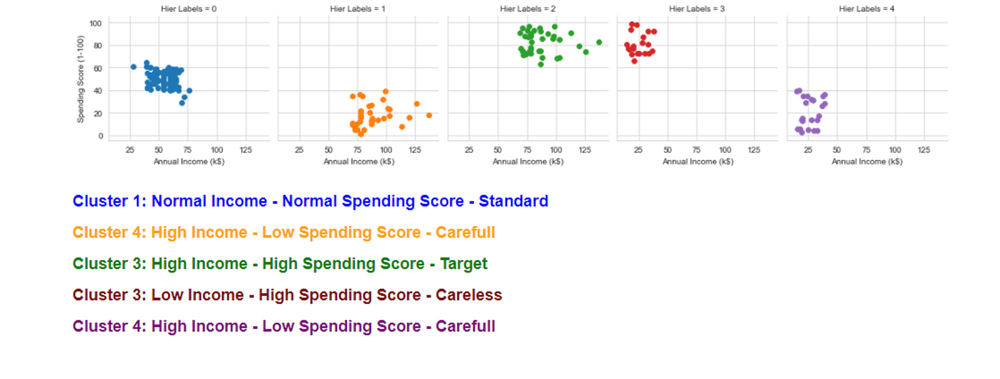

## Data Analysis and Visualisation using Hierarchical Clustering- Agglomerative

In this project I'm trying to analyze and visualize the data and form Clusters. I have 3 input feature i.e Age, Annual Income and Spending Score. Depending on Dendrogram I will determine no of Cluster and visualize them.

## Data Description

    Age - Age of User visiting shop.
    
    Annual Income - It will be in dollar the yearly income of User
    
    Spending Score - Value lies between 1 to 100. 1 being the lowest and 100 being the highest
    
## Process

   1)Read the data set
    
   2)EDA
    
   3)check multicollinearity between input feature
    
   4)Use Dendrogram To Find no of cluster to use
    
   5)Build the Model
    
   6)Visualize the Cluster
    
   7)Find no of data point in each cluster
   
## Softwares and Libraries Used:

    - Anaconda Distribution
	  - Jupyter Notebook
	
	  - Numpy
	  - Pandas
	  - Matplotlib
	  - Seaborn
    - Sklearn 
    - warnings 
    
## Importing the Modules:

    import pandas as pd
    import os as os
    import numpy as np

    #Visuals    
    import matplotlib.pyplot as plt
    import seaborn as sns

    #Pre-processing
    from sklearn.preprocessing import StandardScaler

    #model
    from scipy.cluster.hierarchy import dendrogram, linkage
    from sklearn.cluster import AgglomerativeClustering

    import warnings
    warnings.filterwarnings("ignore")
  
## Analysis:

1)Univariant Analysis

2)Bivariant Analysis

3)Correlation Using HeatMap

4)Hierarchical Clustering Analysis:

5)Dendrogram:

6)Cluster visualize:

7)Cluster Analysis:

## Conclusing Statement

   Thus Using K-Means Clustering I have cluster the data into 5 Cluster Out of which data in Cluster 1 is highest i.e 
   Normal Income - Normal Spending Score and Least in Low income and High spending score

## Note

  You can also view the code in HTML format
